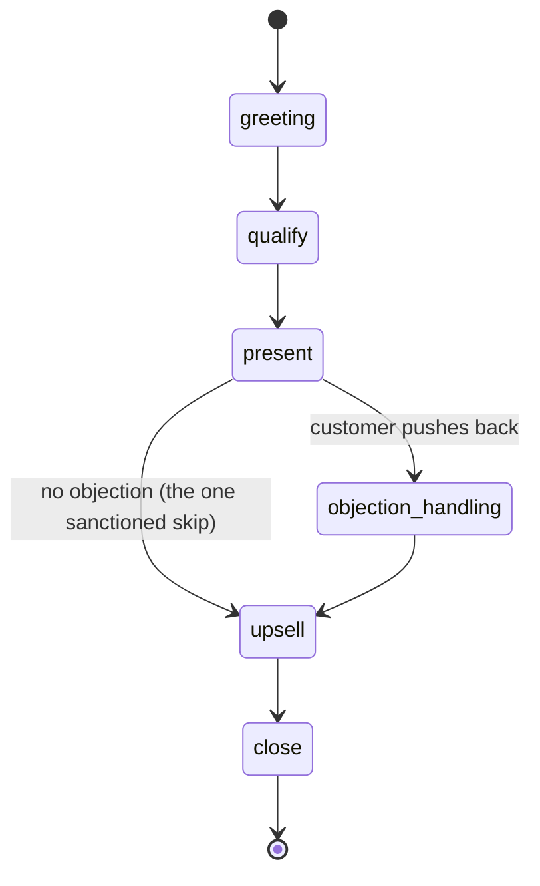

# Sales Agent Service

[](https://github.com/upkero/sales-agent-service/actions/workflows/ci.yml)
[](LICENSE)
[](https://www.python.org/downloads/)

A production-shaped **selling dialogue agent** built around an *explicit* state
machine. The conversation moves through a sales funnel —
`greeting → qualify → present → objection_handling → upsell → close` — and when it
comes time to make an offer, the agent fetches the real price from
[`ops-core-api`](../ops-core-api) so the number the customer hears is the one the
business would actually charge, volume discount and all.

The point of the project is the *shape* of the code, not the size of it: a clean
layered architecture, SOLID seams you can point at, and a state machine driven by
the **Template Method** pattern rather than a pile of `if/elif`.

> Part of a five-service portfolio; all services share the layered architecture in
> [`docs/architecture.md`](docs/architecture.md).

## The state machine



Each stage is a small class that overrides only two things: **what** to tell the
model this turn (`directive`) and **when** to advance (`route`). The orchestrator
never branches on the stage — it looks the current stage up in a registry, asks it
to `handle()` itself, and takes the next stage from the result. Adding a stage is a
new class plus one registry entry; the orchestrator does not change.

The only non-linear edge is `present → upsell`: when the customer raises no
objection, the machine skips objection handling. That is the single permitted
"jump", and it is enforced — see *Design notes* below.

## Architecture

Strict layered architecture with a one-way dependency rule (outer depends on
inner, never the reverse): `api → services → interfaces ← repositories / llm`,
over a base of `contracts`, `core` and `exceptions`. Full diagram and layer
responsibilities in [`docs/architecture.md`](docs/architecture.md).

Patterns you can point at (each is commented in the code as a teaching example):

| Pattern | Where | Why |
|---|---|---|
| **Template Method** | `services/dialog/stages/base.py` | Fixed turn skeleton; stages override only their directive and transition |
| **Adapter** | `repositories/core_api_pricing.py` | An HTTP client that satisfies a port shaped like a plain data repository |
| **Repository** | `interfaces/conversation_repository.py` + `repositories/memory_conversation.py` | Conversation storage behind an abstraction, swappable for a DB later |
| **Strategy** | `services/sales/tactics.py` | Interchangeable rule for *what* to upsell |
| **Factory** | `llm/factory.py`, `repositories/core_api_pricing.py` | The one place each external client is constructed |
| **Dependency Inversion** | everywhere in `services/` | Services depend on `interfaces/` (ABCs), not concrete classes |

## Quickstart

### Run with Docker

You need a running [`ops-core-api`](../ops-core-api) (the price list) and an LLM
endpoint (a local [Ollama](https://ollama.com) is the zero-cost default).

```bash
cp .env.example .env          # set CORE_API_API_KEY to your ops-core-api key
docker compose up --build     # serves on http://localhost:8001
```

### Run locally with uv

```bash
cp .env.example .env
uv sync
uv run uvicorn src.main:app --reload      # http://localhost:8000
```

### Talk to it

The endpoint is `POST /api/v1/sales-agent/turn`. Omit `conversation_id` on the
first turn; pass the id you get back to continue.

```bash
# First turn — the agent greets and the stage advances to "qualify"
curl -s localhost:8000/api/v1/sales-agent/turn \
  -H 'Content-Type: application/json' \
  -d '{"message": "hi, I keep getting knots in my shoulders"}'
```

```json
{
  "conversation_id": "0b0f…",
  "reply": "Hi, I'm Alex from Aurora Wellness! I'd love to help — what are you after?",
  "stage": "qualify",
  "done": false,
  "handoff": false
}
```

```bash
# Continue — reuse the conversation_id you were given
curl -s localhost:8000/api/v1/sales-agent/turn \
  -H 'Content-Type: application/json' \
  -d '{"message": "maybe three deep tissue massages", "conversation_id": "0b0f…"}'
```

Keep going and, at the `present`/`upsell` stages, the reply carries a real total
computed by `ops-core-api` (e.g. six sessions at a 10% volume discount). The
`stage` field is what a frontend uses to light up a progress bar; `done` turns true
at `close`; `handoff` turns true if the agent escalates to a human (see below).

## Tests

```bash
uv run pytest --cov=src/app/services --cov-report=term-missing --cov-fail-under=60
uv run ruff check .
uv run mypy src
```

Every `DialogueStage` is unit-tested in isolation with a **stubbed LLM** (no
network, deterministic), plus a full-funnel test that walks greeting → priced
upsell and asserts the upsell total equals `ops-core-api`'s own arithmetic, and an
HTTP test that drives the real app through `httpx.AsyncClient`. Coverage on the
`services/` layer (the business logic) sits around 96%.

## Design notes

A few decisions worth calling out, because they are where "production-grade" shows
up:

- **The paid endpoint is protected.** Every turn drives an LLM call, so
  `POST /sales-agent/turn` is **rate-limited per client IP** (429 + `Retry-After`
  when exceeded) and can require an **inbound API key** (`X-API-Key`). The key is
  optional — unset, the endpoint is open so the demo runs with no ceremony; set
  `INBOUND_API_KEY` and it is enforced with a constant-time comparison. Health
  probes are never rate-limited.
- **The one-jump guard is enforced, not asserted.** Legal moves are a table in
  `contracts/sales.py`; the orchestrator rejects anything outside it by raising a
  *typed* `InvalidStageTransitionError`, which the exception handler renders as the
  uniform `{detail, error_code}` envelope. No bare `assert` on the request path — an
  `assert` vanishes under `python -O` and, if it did fire, would escape as an
  unhandled 500.
- **A misbehaving model can't wedge the conversation.** Each turn the model returns
  `{"reply", "data"}`; parsing tolerates fences and stray prose. On a miss the agent
  re-asks once; after a bounded number of consecutive failures it stops re-asking
  and returns a graceful human hand-off (`handoff: true`) instead of looping on a
  generic apology.
- **`present` and `upsell` each span two turns** — state the price, *then* read the
  reaction — because branching on a reaction the customer has not given yet is how
  an agent talks over its own offer.
- **Money is `Decimal` end to end.** Prices arrive from `ops-core-api` as strings
  and stay exact; they are never floated.
- **No database, but a bounded store.** Conversation state lives in-process behind a
  `ConversationRepository` port — the seam a Postgres/Redis store would slot into
  unchanged. It cannot leak: conversations expire after a TTL of inactivity and a
  hard cap evicts the least-recently-active (lazy on read, swept on write, no
  background timer). The container pins one worker to match.

## License

[MIT](LICENSE) © 2026 upkero.

---

# Sales Agent Service (Русский)

Продающий диалоговый агент с **явной стейт-машиной**. Диалог идёт по воронке —
`greeting → qualify → present → objection_handling → upsell → close`, а в момент
формирования предложения агент берёт актуальную цену из
[`ops-core-api`](../ops-core-api) (`GET /pricing`), включая объёмную скидку, — то
есть называет ту цену, которую бизнес реально выставил бы.

Смысл проекта — в *форме* кода: чистая слоистая архитектура, явные SOLID-швы и
стейт-машина на паттерне **Template Method**, а не на куче `if/elif`.

### Стейт-машина
Каждая стадия — небольшой класс, переопределяющий только две вещи: **что** сказать
модели в этот ход (`directive`) и **когда** переходить дальше (`route`).
Оркестратор не содержит ветвления по стадиям — он берёт текущую стадию из реестра,
вызывает `handle()` и получает следующую стадию из результата. Единственный
разрешённый «прыжок» — `present → upsell`, когда возражения не возникло; он
контролируется явной таблицей переходов.

### Архитектура
Строгая слоистая архитектура с однонаправленной зависимостью (внешние слои зависят
от внутренних). Диаграмма и ответственность слоёв — в
[`docs/architecture.md`](docs/architecture.md). Применённые паттерны (каждый
прокомментирован в коде как обучающий пример): Template Method, Adapter, Repository,
Strategy, Factory, Dependency Inversion.

### Запуск

```bash
cp .env.example .env          # укажите CORE_API_API_KEY от вашего ops-core-api
docker compose up --build     # http://localhost:8001
```

Локально:

```bash
uv sync
uv run uvicorn src.main:app --reload
```

Эндпоинт — `POST /api/v1/sales-agent/turn`. На первом ходе `conversation_id` не
указывается; полученный id передаётся дальше, чтобы продолжить диалог. Пример
запроса и ответа — в английской части выше.

### Тесты

```bash
uv run pytest --cov=src/app/services --cov-fail-under=60
uv run ruff check .
uv run mypy src
```

Каждая стадия покрыта юнит-тестами изолированно (LLM замокан, без сети,
детерминированно), плюс сквозной тест воронки от приветствия до подсчитанного
апселла и HTTP-тест через `httpx.AsyncClient`. Покрытие слоя `services/` — около 96%.

### Заметки по проду
- Платный эндпоинт защищён: `POST /sales-agent/turn` **ограничен по частоте на IP**
  (429 + `Retry-After`) и может требовать **входной API-ключ** (`X-API-Key`). Ключ
  опционален — без `INBOUND_API_KEY` эндпоинт открыт (чтобы демо запускалось без
  церемоний), с ним — обязателен, сравнение константного времени. Health-пробы не
  лимитируются.
- Инвариант «не более одного прыжка» **обеспечивается**, а не проверяется через
  `assert`: нелегальный переход поднимает типизированное
  `InvalidStageTransitionError` (единый JSON-envelope), а не роняет 500 со стектрейсом.
- Сломанная модель не может «заклинить» диалог: при повторно невалидном JSON агент
  один раз переспрашивает, а затем — ограниченно — эскалирует на человека
  (`handoff: true`), не зацикливаясь.
- Деньги — `Decimal` от начала до конца, без float.
- БД нет, но стор **ограничен**: состояние диалога живёт в памяти за портом
  `ConversationRepository` (готовый шов для замены на Postgres/Redis). Утечки нет —
  диалоги истекают по TTL неактивности, а жёсткий лимит вытесняет наименее
  недавно активный (лениво при чтении, свип при записи, без фонового таймера).
