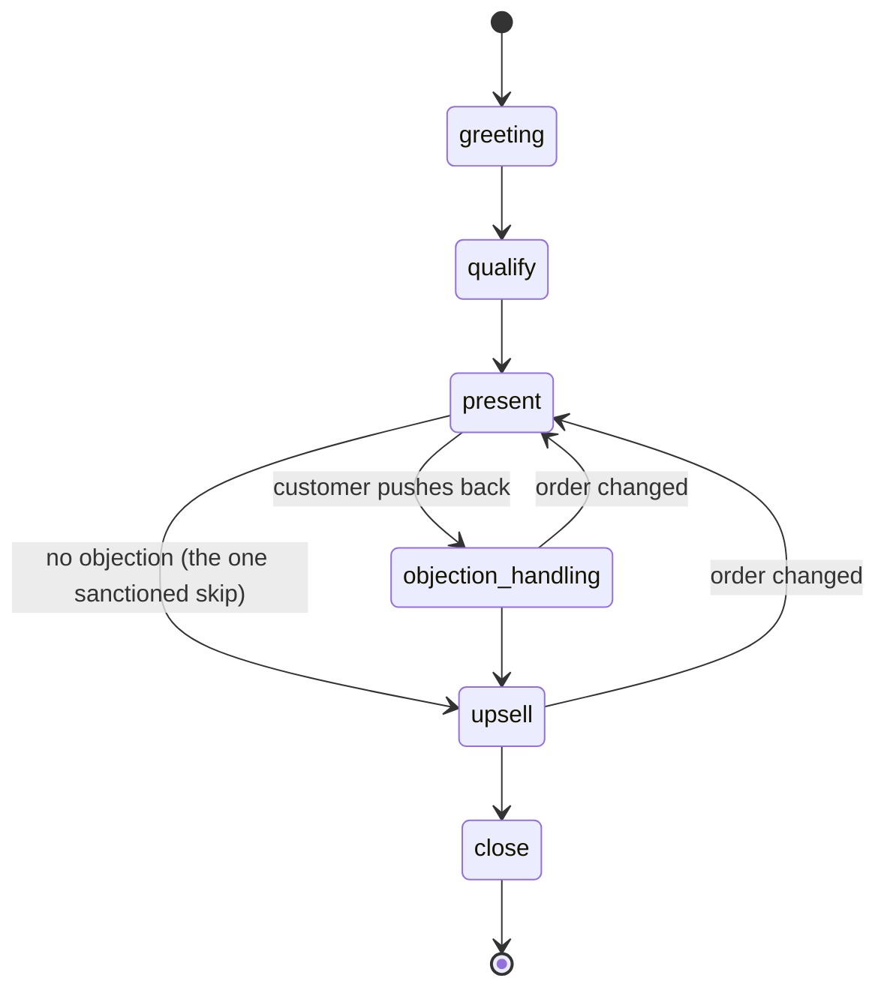

# Sales Agent Service

[](https://github.com/upkero/sales-agent-service/actions/workflows/ci.yml)
[](LICENSE)
[](https://www.python.org/downloads/)

A production-shaped **selling dialogue agent** built around an *explicit* state
machine. The conversation moves through a sales funnel —
`greeting → qualify → present → objection_handling → upsell → close` — and when it
comes time to make an offer, the agent fetches the real price from
[`ops-core-api`](https://github.com/upkero/ops-core-api) so the number the customer
hears is the one the business would actually charge, volume discount and all.

The point of the project is the *shape* of the code, not the size of it: a clean
layered architecture, SOLID seams you can point at, and a state machine driven by
the **Template Method** pattern rather than a pile of `if/elif`.

## The state machine



Each stage is a small class that overrides only two things: **what** to tell the
model this turn (`directive`) and **when** to advance (`route`). The orchestrator
never branches on the stage — it looks the current stage up in a registry, asks it
to `handle()` itself, and takes the next stage from the result. Adding a stage is a
new class plus one registry entry; the orchestrator does not change.

The only non-linear edge is `present → upsell`: when the customer raises no
objection, the machine skips objection handling. That is the single permitted
"jump", and it is enforced — see *Design notes* below. The way back to `present` is
taken only when the customer changes the quantity or the service after hearing a
price: the new order is priced again before the agent says anything about it.

## Architecture

Strict layered architecture with a one-way dependency rule (outer depends on
inner, never the reverse):

```
api/  →  services/  →  interfaces/  ←  gateways/ · repositories/ · llm/
                over contracts/ · core/ · exceptions/
```

- **`api/`** — HTTP only: routing, schemas, middleware, error rendering. It never
  sees a prompt or a price.
- **`services/`** — the dialogue itself: the stage machine and the orchestrator.
- **`interfaces/`** — the ports (ABCs) the services depend on.
- **`gateways/`** vs **`repositories/`** — a gateway is somebody else's service
  over the network (`gateways/core_api_pricing.py`); a repository is a store this
  service owns (`repositories/memory_conversation.py`, in memory today, a Postgres
  table the day a conversation has to survive a restart). Both directories exist
  here on purpose — that is the rule working, not an oversight.
- **`prompts/`** — every model-facing text, as Markdown, in English, with the
  reply language as a `{reply_language}` placeholder. **`messages/`** — the lines
  the customer reads verbatim, one entry per language. Nothing the model reads
  lives in an f-string next to the code that sends it.
- **`contracts/` · `core/` · `exceptions/`** — the base every layer may import.

Patterns you can point at (each is commented in the code as a teaching example):

| Pattern | Where | Why |
|---|---|---|
| **Template Method** | `services/dialog/stages/base.py` | Fixed turn skeleton; stages override only their directive and transition |
| **Adapter** | `gateways/core_api_pricing.py` | An HTTP client that satisfies a port shaped like a plain data repository |
| **Repository** | `interfaces/conversation_repository.py` + `repositories/memory_conversation.py` | Conversation storage behind an abstraction, swappable for a DB later |
| **Strategy** | `services/sales/tactics.py` | Interchangeable rule for *what* to upsell |
| **Factory** | `llm/factory.py`, `gateways/core_api_pricing.py` | The one place each external client is constructed |
| **Dependency Inversion** | everywhere in `services/` | Services depend on `interfaces/` (ABCs), not concrete classes |

## Quickstart

### Run with Docker

You need a running [`ops-core-api`](https://github.com/upkero/ops-core-api) (the
price list) and an LLM endpoint (a local [Ollama](https://ollama.com) is the
zero-cost default).

```bash
cp .env.example .env          # set OPS_CORE_API_KEY to your ops-core-api key
docker compose up --build     # serves on http://localhost:8002
```

`.env.example` ships with `OPS_CORE_API_KEY` and `SECURITY_API_KEY` both set to
`"change-me-min-16-chars"`. That exact
placeholder is shared by all five services in the portfolio, so `cp .env.example
.env` gives a working local demo out of the box — and it is rotated in all five at
once, never in one.

### Run locally with uv

```bash
cp .env.example .env
uv sync
uv run uvicorn src.main:app --reload --port 8002   # http://localhost:8002
```

### Talk to it

The endpoint is `POST /api/v1/turn`. Omit `conversation_id` on the first turn;
pass the id you get back to continue. The optional `language` (`"en"` or `"ru"`)
sets the reply language for the whole conversation; without it the language of
the first message is used, and `AGENT_LANGUAGE` only when that message has no
letters at all.

```bash
export SECURITY_API_KEY=change-me-min-16-chars   # or: set -a; . ./.env; set +a

# First turn — the agent greets and the stage advances to "qualify"
curl -s localhost:8002/api/v1/turn \
  -H "X-API-Key: $SECURITY_API_KEY" -H 'Content-Type: application/json' \
  -d '{"message": "hi, I keep getting knots in my shoulders"}'
```

```json
{
  "conversation_id": "0b0f…",
  "reply": "Hi, I'm Alex from Aurora Wellness! I'd love to help — what are you after?",
  "stage": "qualify",
  "done": false,
  "handoff": false
}
```

```bash
# Continue — reuse the conversation_id you were given
curl -s localhost:8002/api/v1/turn \
  -H "X-API-Key: $SECURITY_API_KEY" -H 'Content-Type: application/json' \
  -d '{"message": "maybe three deep tissue massages", "conversation_id": "0b0f…"}'
```

Keep going and, at the `present`/`upsell` stages, the reply carries a real total
computed by `ops-core-api` (e.g. six sessions at a 10% volume discount). The
`stage` field is what a frontend uses to light up a progress bar. Once the customer
has answered the upsell, the agent asks once for a name and a phone or email and
moves to `close`; their next message gets a single confirmation of the order and
its total, and `done` turns true. `handoff` turns true if the agent escalates to a
human (see below).

## Tests

```bash
uv run pytest --cov=src/app/services --cov-report=term-missing --cov-fail-under=60
uv run ruff check .
uv run mypy .
```

Every `DialogueStage` is unit-tested in isolation with a **stubbed LLM** (no
network, deterministic), plus a full-funnel test that walks greeting → priced
upsell and asserts the upsell total equals `ops-core-api`'s own arithmetic, and an
HTTP test that drives the real app through `httpx.AsyncClient`. Coverage on the
`services/` layer (the business logic) sits around 98%. Two contracts are also
pinned by tests rather than by convention: every prompt renders with the values
its stage actually supplies, and every `error_code` the pricing gateway maps still
exists in `ops-core-api`'s published list (`tests/fixtures/error-codes.json`).

## Design notes

A few decisions worth calling out, because they are where "production-grade" shows
up:

- **The paid endpoint is protected.** Every turn drives an LLM call, so
  `POST /api/v1/turn` is **rate-limited per client IP** (429 + `Retry-After`
  when exceeded) and requires an **inbound API key**: `SECURITY_API_KEY`, sent as
  `X-API-Key` and checked in constant time. It is required, so a missing or
  renamed variable stops the boot instead of leaving a paid endpoint open. Health
  probes need no key and are never rate-limited.
- **CORS is closed until you open it.** `CORS_ALLOWED_ORIGINS` defaults to *empty*,
  not `*`. The `curl` examples above work regardless, but **a browser frontend
  cannot call this service until its origin is listed** — set it in `.env` (CSV,
  e.g. `http://localhost:5173`) or the first thing a consumer meets is a CORS
  error in the console. Credentials are explicitly disallowed: the API key travels
  in a header, never a cookie. CORS is also the **outermost** middleware, so a 429
  from the rate limiter still carries CORS headers instead of reaching the browser
  as an opaque "Failed to fetch".
- **The one-jump guard is enforced, not asserted.** Legal moves are a table in
  `contracts/sales.py`; the orchestrator rejects anything outside it by raising a
  *typed* `InvalidStageTransitionError`, which the exception handler renders as the
  uniform `{detail, error_code}` envelope. No bare `assert` on the request path — an
  `assert` vanishes under `python -O` and, if it did fire, would escape as an
  unhandled 500.
- **A misbehaving model can't wedge the conversation.** Each turn the model returns
  `{"reply", "data"}`; parsing tolerates fences and stray prose. On a miss the agent
  re-asks once; after a bounded number of consecutive failures it stops re-asking
  and returns a graceful human hand-off (`handoff: true`) instead of looping on a
  generic apology.
- **`present` and `upsell` each span two turns** — state the price, *then* read the
  reaction — because branching on a reaction the customer has not given yet is how
  an agent talks over its own offer. The turn that reads the reaction is answered by
  the stage it leads to: "sounds good" gets the upsell offer, not a dead-end "glad to
  hear it" that would push the offer onto the customer's contact details. Whether
  the answer takes the offer is read by a separate, narrow call that sees only the
  offer and the reply — bare contact details are not a yes.
- **Money is `Decimal` end to end.** Prices arrive from `ops-core-api` as strings
  and stay exact; they are never floated.
- **The model never does the arithmetic.** "Actually, make it eight" is priced by
  `ops-core-api` in the same turn, before the reply is written, so the model is
  handed the total instead of working it out. Every reply is then read back: an
  amount that no quote in hand contains is replaced by a fixed sentence carrying the
  real total.
- **No database, but a bounded store.** Conversation state lives in-process behind a
  `ConversationRepository` port — the seam a Postgres/Redis store would slot into
  unchanged. It cannot leak: conversations expire after a TTL of inactivity and a
  hard cap evicts the least-recently-active (lazy on read, swept on write, no
  background timer). The container pins one worker to match.

## License

[MIT](LICENSE) © 2026 upkero.

---

# Sales Agent Service (Русский)

Продающий диалоговый агент с **явной стейт-машиной**. Диалог идёт по воронке —
`greeting → qualify → present → objection_handling → upsell → close`, а в момент
формирования предложения агент берёт актуальную цену из
[`ops-core-api`](https://github.com/upkero/ops-core-api) (`GET /pricing`),
включая объёмную скидку, — то
есть называет ту цену, которую бизнес реально выставил бы.

Смысл проекта — в *форме* кода: чистая слоистая архитектура, явные SOLID-швы и
стейт-машина на паттерне **Template Method**, а не на куче `if/elif`.

### Стейт-машина
Каждая стадия — небольшой класс, переопределяющий только две вещи: **что** сказать
модели в этот ход (`directive`) и **когда** переходить дальше (`route`).
Оркестратор не содержит ветвления по стадиям — он берёт текущую стадию из реестра,
вызывает `handle()` и получает следующую стадию из результата. Единственный
разрешённый «прыжок» — `present → upsell`, когда возражения не возникло; он
контролируется явной таблицей переходов.

### Архитектура
Строгая слоистая архитектура с однонаправленной зависимостью (внешние слои зависят
от внутренних): `api/ → services/ → interfaces/ ← gateways/ · repositories/ · llm/`
поверх `contracts/ · core/ · exceptions/`. Диаграмма и ответственность слоёв — в
английской части выше. `gateways/` — чужой сервис по сети, `repositories/` — стор,
которым владеет этот сервис; здесь есть оба, и это правило в действии, а не
недосмотр. Весь текст для модели — в `prompts/` (Markdown, английский, язык ответа
через плейсхолдер `{reply_language}`); строки, которые клиент читает дословно, — в
`messages/`. Применённые паттерны (каждый прокомментирован в коде как обучающий
пример): Template Method, Adapter, Repository, Strategy, Factory, Dependency
Inversion.

### Запуск

```bash
cp .env.example .env          # укажите OPS_CORE_API_KEY от вашего ops-core-api
docker compose up --build     # http://localhost:8002
```

В `.env.example` лежит `OPS_CORE_API_KEY="change-me-min-16-chars"` — этот
плейсхолдер одинаков во всех пяти сервисах портфолио (поэтому `cp .env.example
.env` сразу даёт рабочее демо) и ротируется сразу во всех пяти, а не в одном.

Локально:

```bash
uv sync
uv run uvicorn src.main:app --reload
```

Эндпоинт — `POST /api/v1/turn`. На первом ходе `conversation_id` не указывается;
полученный id передаётся дальше, чтобы продолжить диалог. Необязательное поле
`language` (`"en"` или `"ru"`) задаёт язык ответов на весь разговор; без него
берётся язык первого сообщения, а `AGENT_LANGUAGE` — только если в нём нет букв.
Пример запроса и ответа — в английской части выше.

### Тесты

```bash
uv run pytest --cov=src/app/services --cov-fail-under=60
uv run ruff check .
uv run mypy .
```

Каждая стадия покрыта юнит-тестами изолированно (LLM замокан, без сети,
детерминированно), плюс сквозной тест воронки от приветствия до подсчитанного
апселла и HTTP-тест через `httpx.AsyncClient`. Покрытие слоя `services/` — около 98%.
Тестами закреплены и два контракта: каждый промпт рендерится теми значениями, которые
реально передаёт его стадия, а каждый `error_code`, который маппит pricing-гейтвей,
всё ещё есть в опубликованном списке `ops-core-api`.

### Заметки по проду
- Платный эндпоинт защищён: `POST /api/v1/turn` **ограничен по частоте на IP**
  (429 + `Retry-After`) и требует **входной API-ключ** `SECURITY_API_KEY` в заголовке
  `X-API-Key` (сравнение константного времени). Ключ обязателен: без него сервис не
  стартует, а не открывает платный эндпоинт всем. Health-пробы ключа не требуют и не
  лимитируются.
- CORS закрыт по умолчанию: `CORS_ALLOWED_ORIGINS` пуст, а не `*`. Примеры с `curl`
  работают в любом случае, но **браузерный фронтенд не сможет обратиться к сервису,
  пока его origin не указан** — иначе первое, что увидит потребитель, это ошибка
  CORS в консоли. CORS зарегистрирован самым внешним слоем middleware, поэтому 429
  от рейт-лимитера доходит до браузера с CORS-заголовками, а не как невнятное
  «Failed to fetch».
- Инвариант «не более одного прыжка» **обеспечивается**, а не проверяется через
  `assert`: нелегальный переход поднимает типизированное
  `InvalidStageTransitionError` (единый JSON-envelope), а не роняет 500 со стектрейсом.
- Сломанная модель не может «заклинить» диалог: при повторно невалидном JSON агент
  один раз переспрашивает, а затем — ограниченно — эскалирует на человека
  (`handoff: true`), не зацикливаясь.
- На «звучит хорошо» сразу отвечает следующий этап: предложение апселла приходит в
  том же ходе, а не в ответ на следующее сообщение клиента (обычно это его контакты).
- После ответа на апселл агент один раз просит имя и телефон или email и переходит в
  `close`; следующее сообщение клиента получает одно итоговое подтверждение заказа с
  суммой, и `done` становится `true`.
- Деньги — `Decimal` от начала до конца, без float.
- Модель не считает сама. «А давайте восемь» пересчитывается в `ops-core-api` в том
  же ходе, до генерации ответа, и модель получает готовый итог. Каждый ответ затем
  проверяется: сумму, которой нет ни в одной полученной котировке, заменяет
  фиксированная фраза с настоящим итогом. Возврат в `present` из
  `objection_handling` и `upsell` разрешён только для такого пересчёта.
- БД нет, но стор **ограничен**: состояние диалога живёт в памяти за портом
  `ConversationRepository` (готовый шов для замены на Postgres/Redis). Утечки нет —
  диалоги истекают по TTL неактивности, а жёсткий лимит вытесняет наименее
  недавно активный (лениво при чтении, свип при записи, без фонового таймера).
