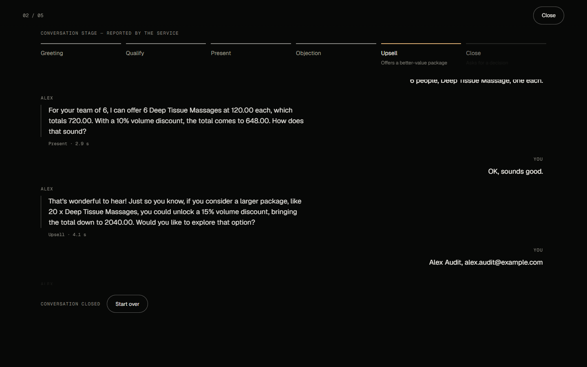

# Sales Agent Service (Русский)

*[English version](README.md)*

Продающий диалоговый агент с **явной стейт-машиной**. Диалог идёт по воронке —
`greeting → qualify → present → objection_handling → upsell → close`, а в момент
формирования предложения агент берёт актуальную цену из
[`ops-core-api`](https://github.com/upkero/ops-core-api) (`GET /pricing`),
включая объёмную скидку, — то
есть называет ту цену, которую бизнес реально выставил бы.



*Живое демо: шкала этапов следует за разговором от приветствия до закрытия.*

Смысл проекта — в *форме* кода: чистая слоистая архитектура, явные SOLID-швы и
стейт-машина на паттерне **Template Method**, а не на куче `if/elif`.

### Стейт-машина
Каждая стадия — небольшой класс, переопределяющий только две вещи: **что** сказать
модели в этот ход (`directive`) и **когда** переходить дальше (`route`).
Оркестратор не содержит ветвления по стадиям — он берёт текущую стадию из реестра,
вызывает `handle()` и получает следующую стадию из результата. Единственный
разрешённый «прыжок» — `present → upsell`, когда возражения не возникло; он
контролируется явной таблицей переходов.

### Архитектура
Строгая слоистая архитектура с однонаправленной зависимостью (внешние слои зависят
от внутренних): `api/ → services/ → interfaces/ ← gateways/ · repositories/ · llm/`
поверх `contracts/ · core/ · exceptions/`. Диаграмма и ответственность слоёв — в
английской части выше. `gateways/` — чужой сервис по сети, `repositories/` — стор,
которым владеет этот сервис; здесь есть оба, и это правило в действии, а не
недосмотр. Весь текст для модели — в `prompts/` (Markdown, английский, язык ответа
через плейсхолдер `{reply_language}`); строки, которые клиент читает дословно, — в
`messages/`. Применённые паттерны (каждый прокомментирован в коде как обучающий
пример): Template Method, Adapter, Repository, Strategy, Factory, Dependency
Inversion.

### Запуск

```bash
cp .env.example .env          # укажите OPS_CORE_API_KEY от вашего ops-core-api
docker compose up --build     # http://localhost:8002
```

В `.env.example` лежит `OPS_CORE_API_KEY="change-me-min-16-chars"` — этот
плейсхолдер одинаков во всех пяти сервисах портфолио (поэтому `cp .env.example
.env` сразу даёт рабочее демо) и ротируется сразу во всех пяти, а не в одном.

Локально:

```bash
uv sync
uv run uvicorn src.main:app --reload
```

Эндпоинт — `POST /api/v1/turn`. На первом ходе `conversation_id` не указывается;
полученный id передаётся дальше, чтобы продолжить диалог. Необязательное поле
`language` (`"en"` или `"ru"`) задаёт язык ответов на весь разговор; без него
берётся язык первого сообщения, а `AGENT_LANGUAGE` — только если в нём нет букв.
Пример запроса и ответа — в английской части выше.

### Тесты

```bash
uv run pytest --cov=src/app/services --cov-fail-under=60
uv run ruff check .
uv run mypy .
```

Каждая стадия покрыта юнит-тестами изолированно (LLM замокан, без сети,
детерминированно), плюс сквозной тест воронки от приветствия до подсчитанного
апселла и HTTP-тест через `httpx.AsyncClient`. Покрытие слоя `services/` — около 98%.
Тестами закреплены и два контракта: каждый промпт рендерится теми значениями, которые
реально передаёт его стадия, а каждый `error_code`, который маппит pricing-гейтвей,
всё ещё есть в опубликованном списке `ops-core-api`.

### Заметки по проду
- Платный эндпоинт защищён: `POST /api/v1/turn` **ограничен по частоте на IP**
  (429 + `Retry-After`) и требует **входной API-ключ** `SECURITY_API_KEY` в заголовке
  `X-API-Key` (сравнение константного времени). Ключ обязателен: без него сервис не
  стартует, а не открывает платный эндпоинт всем. Health-пробы ключа не требуют и не
  лимитируются.
- CORS закрыт по умолчанию: `CORS_ALLOWED_ORIGINS` пуст, а не `*`. Примеры с `curl`
  работают в любом случае, но **браузерный фронтенд не сможет обратиться к сервису,
  пока его origin не указан** — иначе первое, что увидит потребитель, это ошибка
  CORS в консоли. CORS зарегистрирован самым внешним слоем middleware, поэтому 429
  от рейт-лимитера доходит до браузера с CORS-заголовками, а не как невнятное
  «Failed to fetch».
- Инвариант «не более одного прыжка» **обеспечивается**, а не проверяется через
  `assert`: нелегальный переход поднимает типизированное
  `InvalidStageTransitionError` (единый JSON-envelope), а не роняет 500 со стектрейсом.
- Сломанная модель не может «заклинить» диалог: при повторно невалидном JSON агент
  один раз переспрашивает, а затем — ограниченно — эскалирует на человека
  (`handoff: true`), не зацикливаясь.
- На «звучит хорошо» сразу отвечает следующий этап: предложение апселла приходит в
  том же ходе, а не в ответ на следующее сообщение клиента (обычно это его контакты).
- После ответа на апселл агент один раз просит имя и телефон или email и переходит в
  `close`; следующее сообщение клиента получает одно итоговое подтверждение заказа с
  суммой, и `done` становится `true`.
- Деньги — `Decimal` от начала до конца, без float.
- Модель не считает сама. «А давайте восемь» пересчитывается в `ops-core-api` в том
  же ходе, до генерации ответа, и модель получает готовый итог. Каждый ответ затем
  проверяется: сумму, которой нет ни в одной полученной котировке, заменяет
  фиксированная фраза с настоящим итогом. Возврат в `present` из
  `objection_handling` и `upsell` разрешён только для такого пересчёта.
- БД нет, но стор **ограничен**: состояние диалога живёт в памяти за портом
  `ConversationRepository` (готовый шов для замены на Postgres/Redis). Утечки нет —
  диалоги истекают по TTL неактивности, а жёсткий лимит вытесняет наименее
  недавно активный (лениво при чтении, свип при записи, без фонового таймера).
